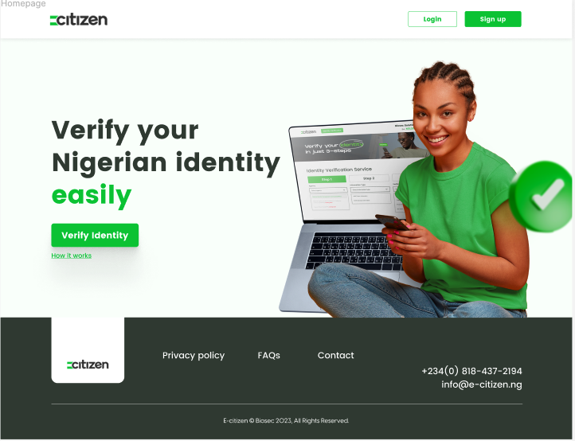

# Product E-Citizen

This repository contains the E-Citizen Front-end built with React, styled-components, react-router, and react hooks. All the components are reusable and can be used for any dynamic content. It's fully responsive for all the platforms.

# Description 

e-Citizen allows you to see and verify it. eCitizen is a secure way to verify your Nigerian identity online. It makes it safe, quick and easy to access government services like filing your tax or checking the information on your driving licence and much more

# Tech Stack
* React
* Styled Components
* React Router
* React Hooks

# Screenshot

# Credits
@danielochinasa
